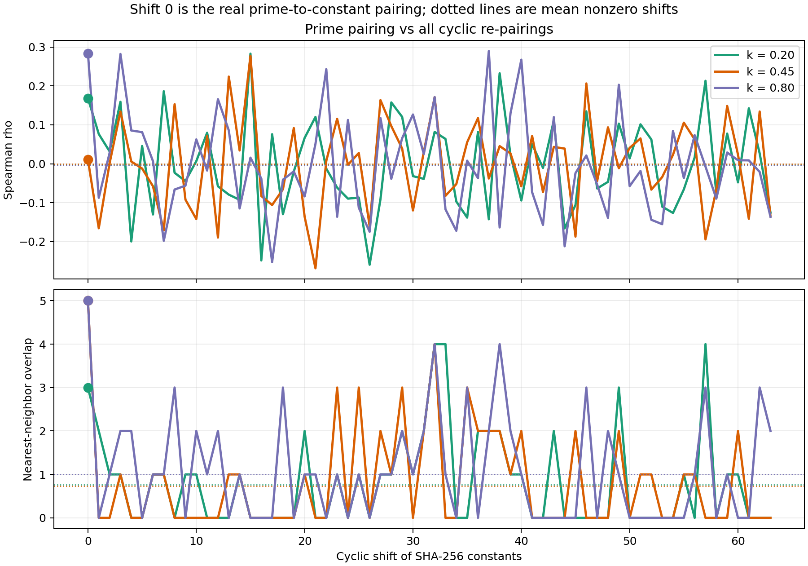
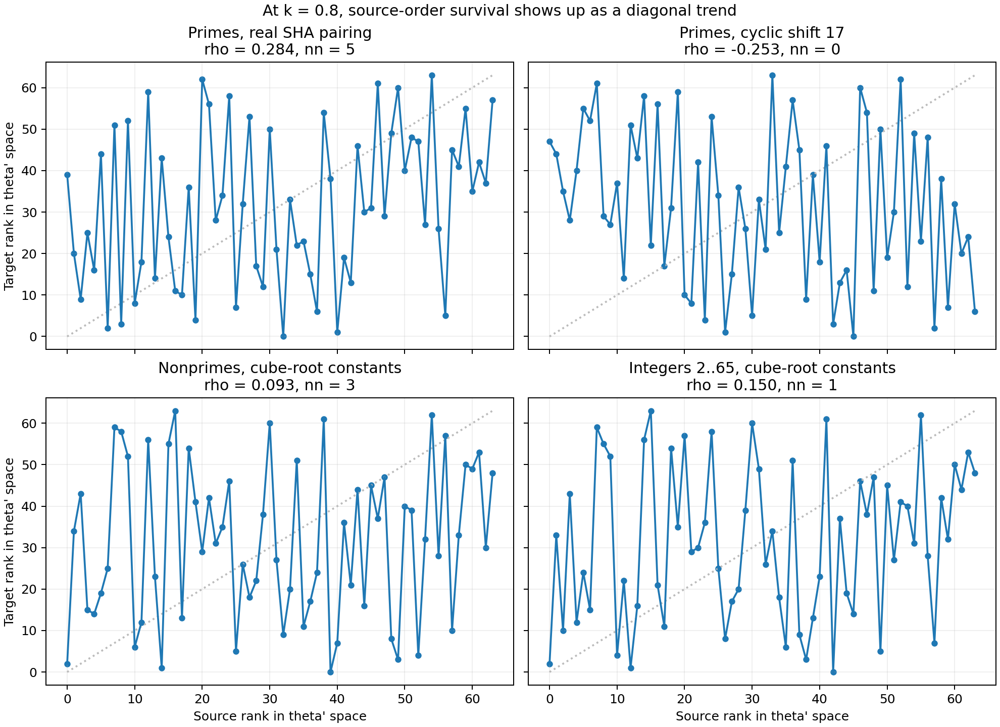
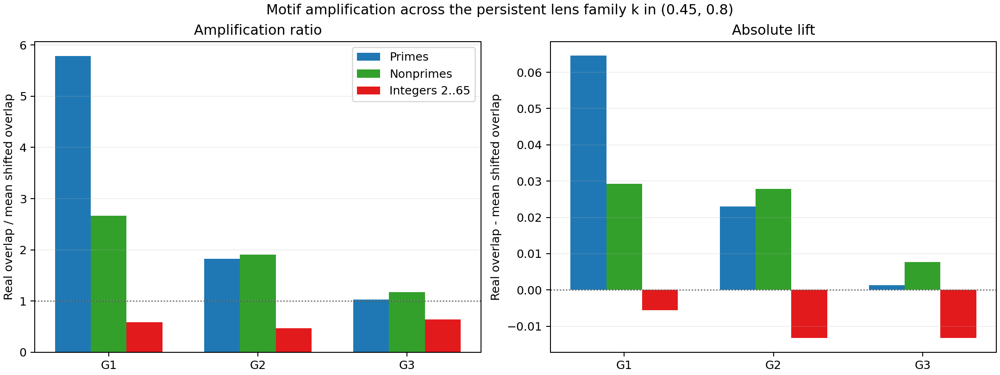
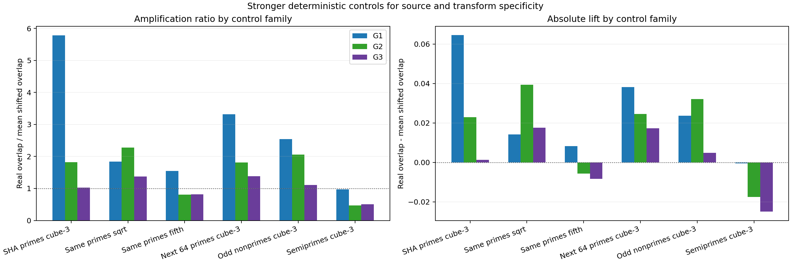
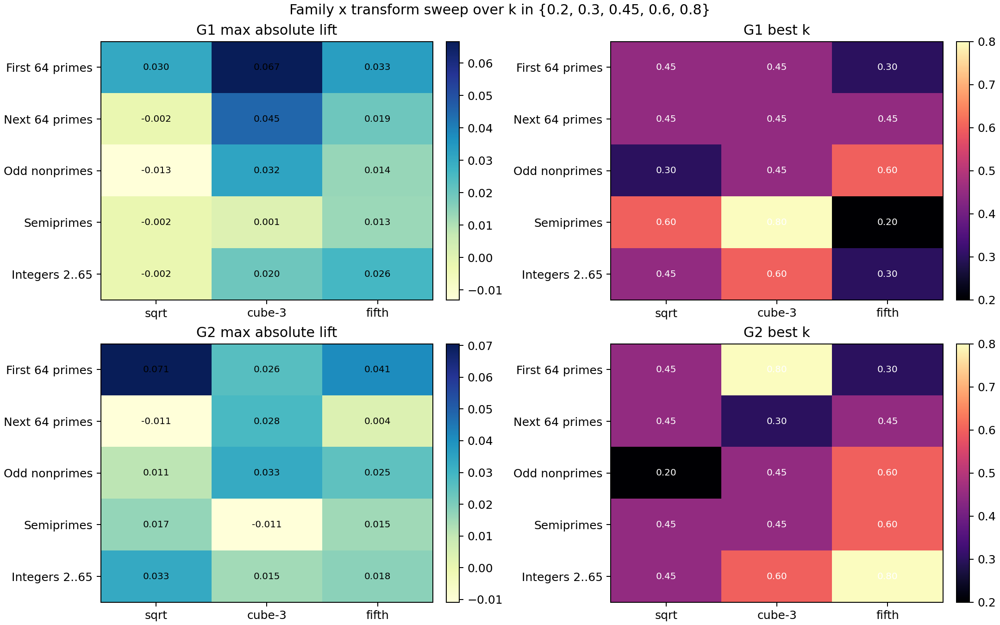

# Retained Local Structure in Prime-Derived Transport

## What We Observed

This note records a surprising result from the current `sha256-bounds`
plotting probes.

The round constants of SHA-256 are built from the fractional parts of the
cube roots of the first 64 primes. We mapped those source primes and their
derived constants into the same phi-space coordinate system and asked a narrow
question:

Do nearby source points stay nearby after the transport?

The surprising answer is yes, at least at the level of local neighborhoods.

The strongest signal does not come from asking whether the constants land on
special phi-space points by themselves. It comes from asking whether the real
source-to-constant pairing preserves local structure better than deterministic
control pairings.

## What "Local Structure" Means Here

In this note, local structure means relations between nearby points, not
absolute position.

For a given lens parameter `k`, each source number and each derived constant is
placed in the same `theta'(·, k)` space already used by `geofac`. We then ask:

- whether the rank order of points is partly preserved,
- whether a point keeps the same nearest neighbor,
- whether small neighbor sets overlap more than shifted controls.

This is a relational test. A constant does not need to land near its own
source coordinate. It only needs to preserve who is near whom.

## Why This Is Surprising

The source numbers go through several aggressive steps before we inspect them:

1. take a nonlinear root,
2. keep only the fractional part,
3. scale to 32 bits and truncate,
4. remap the result through a phi-based lens.

A reasonable prior is that these steps would destroy most fine local source
structure. The plots show that this does not fully happen.

What survives is not exact position. What survives is local topology.

## The Main Findings

### 1. Pointwise alignment is not the main story

The current probes do not support a strong headline claim that the SHA-256
constants are unusually phi-aligned in isolation.

The stronger result is elsewhere: the real pairing between source primes and
their derived constants preserves local structure better than cyclic
re-pairings.

### 2. The real prime pairing stands out most at first-order locality

The plotting script in
[`sha256-bounds/scripts/plot_prime_survival.py`](../sha256-bounds/scripts/plot_prime_survival.py)
defines motif amplifiers `G1`, `G2`, and `G3`.

- `G1` measures first-order neighborhood retention.
- `G2` measures two-neighbor retention.
- `G3` measures three-neighbor retention.

Using the persistent lens family `k in {0.45, 0.8}`, the prime-derived SHA
family gave:

- `G1 = 5.78`
- `G2 = 1.82`
- `G3 = 1.03`

This means the real source-to-constant pairing is far more coherent than
shifted controls at the first local layer, still above control at the second
layer, and nearly back to baseline by the third.

The retained structure is therefore shallow rather than deeply recursive.

### 3. The strongest regime lands at the same lens value that matters in geofac

We swept source families, transport families, and lens values over
`k in {0.2, 0.3, 0.45, 0.6, 0.8}`.

The strongest first-order lift in that sweep was:

- `First 64 primes + cube-3` at `k = 0.45`

The strongest second-order lift in that sweep was:

- `First 64 primes + sqrt` at `k = 0.45`

Across the full family-by-transform sweep, `k = 0.45` was the most common
best lens for both `G1` and `G2`.

That matters because `k = 0.45` is already the balanced lens in `geofac`.
The same observational regime that sharpens the transport result is also the
regime that the factorization side already treats as useful.

### 4. The effect is not unique to SHA, but SHA is the strongest first-order case we tested

Stronger deterministic controls show that this is not a one-family-only
phenomenon.

Other structured source families can also retain locality under root-based
transport. In particular:

- `Next 64 primes + cube-3` shows clear first-order lift.
- `Odd nonprimes + cube-3` also shows first-order lift.
- `Semiprimes + cube-3` mostly collapse.

So the current evidence does not say that SHA alone has this property.
It says that prime-derived root transport can preserve local phi-space
structure, and that the SHA family is the strongest first-order example we
have tested so far.

## What This Changes

This finding makes two threads in the repository look less separate.

`sha256-bounds` is no longer only a question about whether SHA-256 constants
look unusual on their own. It becomes a transport test:

does a prime-derived map preserve local phi-space structure after nonlinear
compression and truncation?

`geofac` is no longer only a heuristic that filters candidates by scalar
closeness. It now has a candidate mechanism:

the filter may be exploiting retained local structure in phi-space rather than
only pointwise proximity.

That gives the repository a more coherent empirical center:

prime-derived transports may preserve local phi-space structure strongly enough
to remain measurable after nonlinear maps.

## What the Plots Show

Generated figures are in
[`sha256-bounds/out/prime_survival/`](../sha256-bounds/out/prime_survival/).

### Shift Spectrum

The real prime pairing at shift `0` stands above most cyclic re-pairings.

### Rank Transfer at `k = 0.80`

The real prime pairing shows a diagonal trend that the control panels weaken.

### Motif Amplification

The retained structure is strongest at `G1`, weaker at `G2`, and nearly gone
at `G3`.

### Stronger Deterministic Controls

The SHA family is the strongest `G1` case among the tested deterministic
controls.

### Family x Transform Sweep

The best regimes cluster around `k = 0.45`.

## Exact Scope

This note supports a narrow claim.

It supports the claim that local source structure can survive prime-derived
transport into phi-space observables, and that the first 64 SHA source primes
under cube-root transport give the strongest first-order signal tested here.

It does not yet support a stronger claim that all such transport is unique to
SHA or that deeper multi-layer motif structure survives intact.

## Next Tests

The next useful tests are direct extensions of the current note.

1. Replace scalar candidate ranking in `geofac` with local motif consistency
   and compare factor-search performance.
2. Expand the control family sweep beyond the current deterministic set.
3. Test nearby phi-space observables to see whether locality retention is
   specific to `theta'(·, k)` or stable across related lenses.
4. Check whether the same locality-retention regime persists as the source
   family moves to larger primes.
